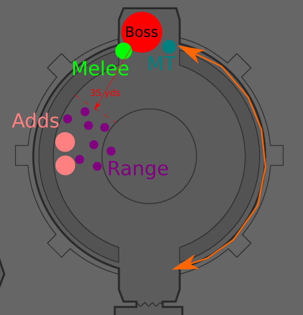
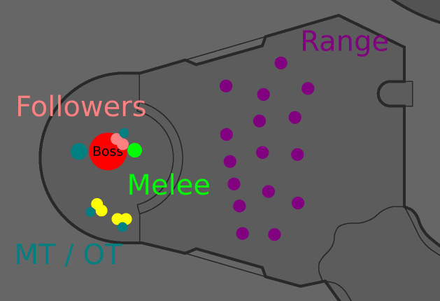
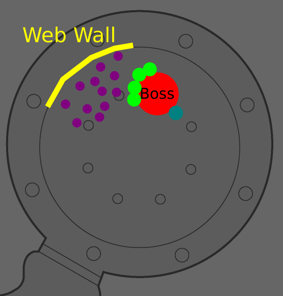

# Spider Wing

## Anul'Rekhan

Two phases, one tank and spank, and a boss kitting and add dps phase.

### Abilities

- Impale:
  - Target a **random** person and impales it
  - **35 yds** range, in direction of target
  - **4000 physical dmg** + Knock in the air if **on path**
- Locust Swarm:
  - 90 seconds cooldown, first one between 70 and 120 seconds from pull
  - 30 yds radius
  - **1200 dmg** / 2sec stacking + silence (any skill, including melee, auto attack, etc)
  

### Tank

- Boss (1 Tank)
  - When Locust Swarm is casted, move the boss along the room edges to opposite side of the room
  - Always use the same side of the room
- Adds (1-2 Tanks)
  - Two adds
  - **~1000 avg dmg** melee attacks
  - AoE rooting

### Heal

- Heal MT
- Out-range Locust Swarm at all time
- Out-range Imaple
- Move ahead of MT when MT has to move to otherside of room
- Raid dmg is minimal during the fight except on tanks

### Ranged

- Keep **35yds** away from boss
- **DPS Adds** > DPS Boss

### Melee

- Locust Swarm
  - Move quickly when boss cast
  - Move quickly on adds so not to be rooted out of melee range
- **DPS Adds** > DPS Boss

---

## Grand Widow Faerlina

The fight as two *phases*. Killig the adds and then killing the boss.

### Abilities

#### Boss
- Poison Bolt Volley
  - Viscidus like
  - Dispellable, Resistable
  - **1450 Nature dmg** + **450 dmg / 2 seconds** for 4 seconds
  - **10** persons
- Rain of Fire
  - Gehennas like
  - **2000 dmg / tick**
  - Resistable
- Enrage
  - 60 seconds (+75% dmg)
  - Sacrifice add
   - Already enrage
     - Dispell enrage
     - Restart 60 seconds timer
     - Stop Poison Bolt Volley for 30 seconds
   - No enrage: Delay enrage by 30sec (No sure if that)
     - Add 30seconds to enrage time

#### Add (Worshipper x4, Followers x2)
- Worshipper
  - 250 000 HP
  - MC to dispell enrage or delay
- Followers
  - 100 000 HP
  - Stunnable

### Strategy

Cleave down the Followers on Faerlina. Off-tanking of the Worshipper on the side. Once the Followers are down, focus Faerlina. Depending on raid DPS we might play safe and silence Faerlina before she enrages, so prevent the MT from being killed, or we wait for the full 60sec and dispell only after the enrage occured. Ranged must be spread around the room to prevent Rain of Fire from hitting too many ppl at once.

### Tank

- MT tanks Fearlina
- 2x OT tank two Worshipper each
- 1-2x OT tanks two Followers

- All Tank
  - Move away from Rain of Fire

### Heal

- Keep tank alive
- Dispell Poison Bolt Volley on all raid
- Move away from Rain of Fire

#### Priest

- One priest must MC a Worshipper 10 seconds before Enrage
- Use Workshipper sacrifice hability when Faerlina Enrage

### Ranged

- Focus **Followers** and cleave Faerlina
- Move away from Rain of Fire
- Use **fire potion** to prevent dmg
- Use **poison elixir** on Poison Bolt Volley

### Melee

- Focus **Followers** and cleave Faerlina
- Move away from Rain of Fire
- Use **fire potion** to prevent dmg
- Use **poison elixir** on Poison Bolt Volley

---
## Maexxna

### Abilities

- Web Wrap
  - first at 20 seconds, then every 40 seconds
  - 6 000 HP
  - sends one person on the wall in a cocoon
  - most of the time only range dps can dps the cocoon
  - **650-850 nature dmg** / seconds
  - falling dmg when high on the wall
- Web Spray
  - 40 seconds
  - **Stuns** everyone for **8 seconds**
  - **1750-2250 nature dmg**
  - Ice Block, Divine Shield etc don't work
    - ID, Flask of Petrification works
- Poison Shock
  - **1750-2250 nature dmg**
  - front cone, 15 yds
- Necrotic Poison
  - -90% healing
  - 30 seconds
  - Abolish Poison is more effective dispell
- Enrage
  - 30% health
  - attack speed and dmg increase
- Spider Spawn
  - 8-10 spiders
  - at 30seconds from pull

### Strategy

- Use Greater Nature Protection Potion for the Web Spray

### Tank
- MT Maexxna
- OT to AoE Taunt adds when spawned
  - otherwise DPS

### Heals
- Heal MT
  - Keep a Abolish Poison on tank for Necrotic Poison
  - Keep HoT on MT for 8 seconds stun phase
- Heal Webbed ppl
  - Keep HoT on Webbed ppl for 8 seconds stun phase
- Paladins
  - Hand of Protection on mages for AoE of spiders add

### Range
- About 5 ranges will be assign to dps the webbed ppl
  - Certainly hunters + instant from other classes
- Other range on Maexxna
- mages
  - AoE Spider Spawns
- Don't spread out too much to prevent add from running around

### Melee
- Focus Maexna from start to finish